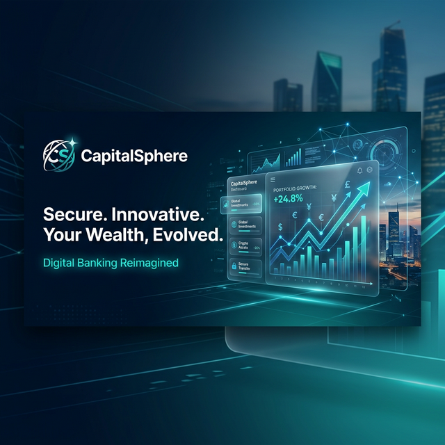
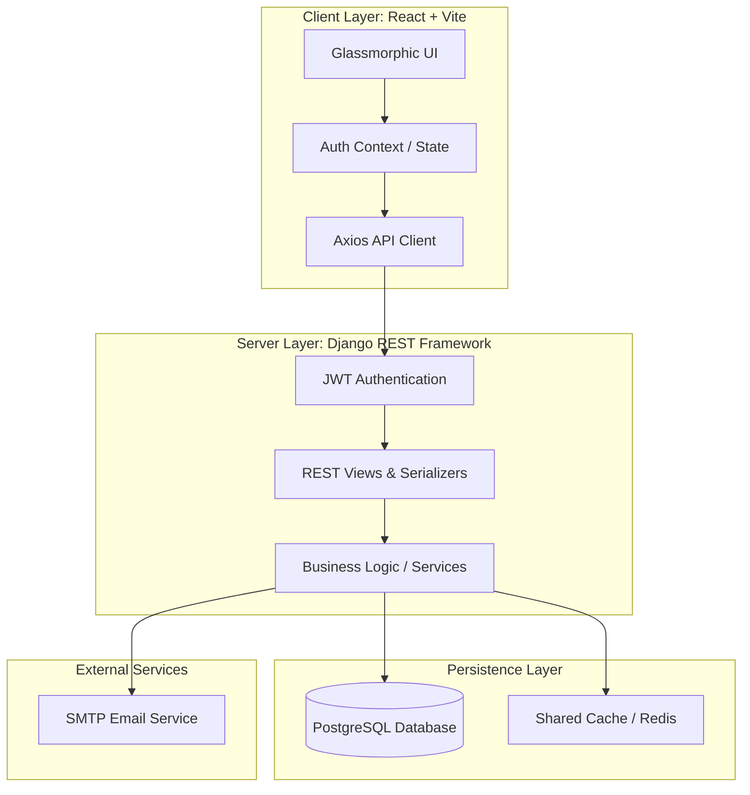
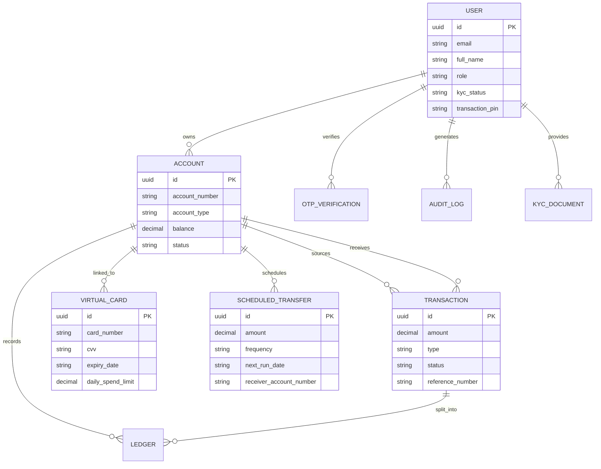
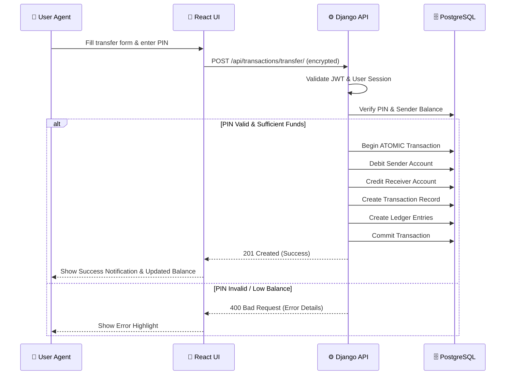

# 🏦 CapitalSphere: Digital Banking Ecosystem



CapitalSphere is a professional, high-trust digital banking application built using a modern **Django + React** tech stack. It provides a secure, glassmorphic UI for managing personal accounts, fund transfers, and loan applications, with full administrative control for banking staff.

---

## 🚀 Key Features

### 👤 User Services
- **Secure Authentication**: JWT-based login with optional OTP verification.
- **KYC Onboarding**: Digital document submission and verification tracking.
- **Account Management**: Support for Savings, Current, FD, and Salary accounts.
- **Modern Dashboard**: Real-time balance tracking and financial analytics using Recharts.

### 💳 Advanced Capabilities (New)
- **Virtual Cards Widget**: Generate dynamic, instantly usable digital cards linked to any account with robust security parameters.
- **Automated Payments**: Configure recurring, scheduled transfers (daily, weekly, monthly) using a cron-like architecture.
- **High-Performance Architecture**: Includes React code-splitting (`React.lazy`), batch-deduplication, and advanced Django QuerySet optimizations mitigating N+1 bottlenecks.

### 💸 Transactions & Loans
- **Fund Transfers**: Secure transfers between accounts with transaction PIN validation.
- **Beneficiary Management**: Save frequently used account details.
- **Loan Lifecycle**: Application, review by loan officers, and automated disbursement/repayment.
- **Transaction History**: Filterable, paginated history with risk scoring and audit logs.

### 🛡️ Security & Administration
- **Advanced Permissions**: Granular roles (User, Admin, Super Admin, Loan Officer).
- **Audit Logs**: Comprehensive tracking of all critical user actions and login sessions.
- **Pin Verification**: Hashed transaction PINs for double-factor fund security.

---

## 🏛️ System Hardening & Enterprise Features

To elevate the platform from feature-complete to production-ready, multiple asynchronous and strict database-level architectural patterns have been implemented:

### 💥 Transaction Consistency & Core Stability
- **Deadlock Prevention (Ordered DB Locks)**: PostgreSQL `select_for_update` calls are structurally ordered (`acc_ids = sorted([sender_id, receiver_id])`) before query execution, ensuring cross-transfer threads never trigger database deadlocks.
- **Idempotent APIs**: Core payment and transfer endpoints strictly require and validate `Idempotency-Key` headers against the transaction ledger, unconditionally preventing duplicate executions during network retries.

### 🛡️ Fraud & Risk Engine
- **IP / Geo Anomaly Tracking**: Advanced risk-scoring engine compares structural bound elements like explicit `client_ip` against the previously logged active sessions (`last_login_ip`).
- **Immediate Hard-Blocks**: Thresholding triggers (+30 score per anomaly). Transactions breaching severe composite risk scores (>=90) immediately raise exception kill-switches, bypassing standard evaluation and securely reverting all Atomic sequences.

### 🔐 Security & Trust
- **Token Revocation (Logout Auditing)**: SimpleJWT token blacklisting naturally invalidates tokens the moment a session closes.
- **Granular Payload Throttling**: Pre-configured DRF API rate-limiters (`AnonRateThrottle`, `UserRateThrottle`) block brute forcing across identity and transfer endpoints.

### ⏱️ Async Processing & Scalability (Celery + Redis)
- **Decoupled Job Queues**: Heavy latency-bound workloads (such as generating and compiling HTML templates for internal OTP SMTP relays) are offloaded onto local Celery background workers.
- **Automated Queueing (Celery Beat)**: Scheduled, daily interval automation pushes pre-configured scheduled transfers robustly via dedicated idempotency tags, bypassing fragile sleep loops or raw cron hacks.

---

## 🏛️ System Architecture



---

## 📊 Database Schema (ERD)



---

## 🔄 Transaction Workflow (Core Sequence)



---

## 🛠️ Technology Stack

| Layer | Technologies |
|---|---|
| **Frontend** | React 19, Vite, TailwindCSS (for Layouts), Lucide Icons, Recharts |
| **Backend** | Django 5, Django REST Framework, SimpleJWT, WhiteNoise |
| **Database** | PostgreSQL |
| **Security** | Argon2 Hashing, JWT Rotation, OTP-based Verification |

---

## ⚙️ Setup & Installation

### Prerequisites
- Python 3.10+
- Node.js 18+
- PostgreSQL

### Backend Setup
1. Navigate to `backend/`
2. Create and activate a virtual environment:
   ```bash
   python -m venv venv
   source venv/bin/activate  # On Windows: venv\Scripts\activate
   ```
3. Install dependencies:
   ```bash
   pip install -r requirements.txt
   ```
4. Configure environment variables in `.env`:
   ```env
   DB_NAME=bank
   DB_USER=postgres
   DB_PASSWORD=your_password
   SECRET_KEY=your_secret_key
   ```
5. Run migrations:
   ```bash
   python manage.py migrate
   ```
6. Start the server:
   ```bash
   python manage.py runserver
   ```

### Frontend Setup
1. Navigate to `frontend/`
2. Install dependencies:
   ```bash
   npm install
   ```
3. Run the development server:
   ```bash
   npm run dev
   ```

---

## 📄 License
This project is licensed under the MIT License - see the [LICENSE](LICENSE) file for details.

---
*Created with ❤️ for CapitalSphere.*
